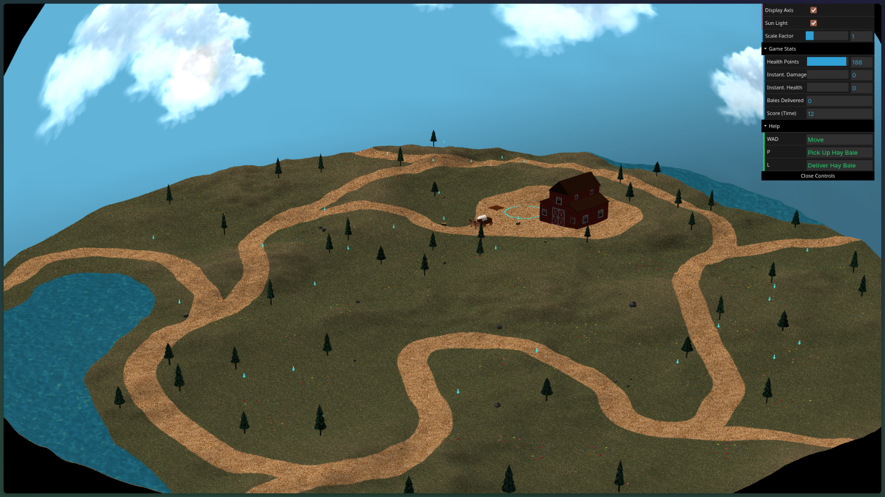
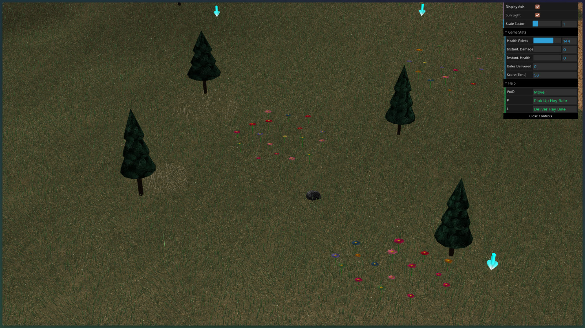
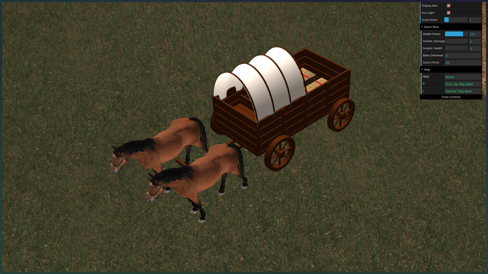
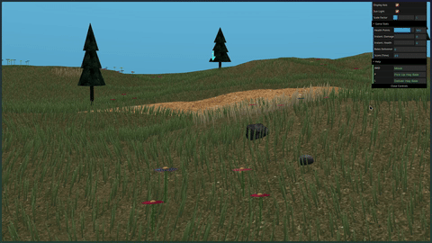
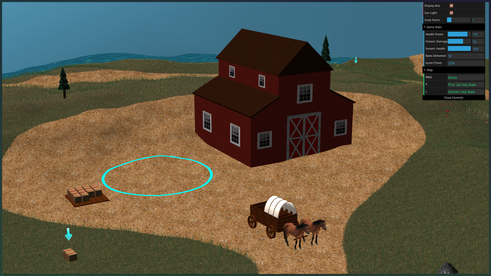

# Spring Prairie Survival Game — CGRA 2025/2026
**L.EIC (3rd Year) — Computação Gráfica**  
**Faculdade de Engenharia da Universidade do Porto (FEUP)**  

## Group T10G06 / T02G06

| Name                   | Student Number | E-Mail            |
| :--------------------- | :------------- | :---------------- |
| **Carolina Ferreira**  | 202303547      | up202303547@up.pt |
| **Francisca Portugal** | 202303640      | up202303640@up.pt |
| **Pedro Monteiro**     | 202307242      | up202307242@up.pt |

## Game & Scene Description

This project is a 3D interactive survival game built from scratch using the **WebCGF library** and custom **WebGL/GLSL shaders**. The scene is set in a vibrant spring prairie landscape under a dynamic sky dome. 

### Core Gameplay Loop
The player drives a hierarchical **Prairie Schooner (wagon)** and must survive for as long as possible.
*   **HP Decay:** The wagon starts with `200 HP` which continuously decreases over time at a rate of `1 HP/second`.
*   **Hay Bales Collection:** Bales are spawned randomly across the prairie. Due to fog/visibility limits, bales are only visible when the wagon gets within `40 units` of them (fading into view dynamically). A **bobbing 3D arrow** powered by a custom vertex/fragment shader pinpoints them from afar.
*   **Cargo Limit:** The wagon bed can carry a maximum of **2 hay bales** at a time. Carried bales are rendered dynamically side-by-side inside the wagon.
*   **Delivery & Healing:** The player must drive the wagon to the glowing **Delivery Circle** in front of the wooden barn. When inside the circle, the boundary glows green, and pressing `L` deposits the bales onto the wooden platform, restoring `50 HP` per bale.
*   **Obstacles:** Driving into rocks, trees, the barn or the haybale platform damages the wagon, deducting a random damage value between `5 and 15 HP` and triggering a **red damage flash** effect on the wagon model. 
*   **Game Over:** The game ends when HP reaches zero. The score is the total number of seconds the player remained alive. A stylized game-over overlay displays the final score and allows restarting the adventure instantly.


## How to Run the Project

Since WebCGF loads shaders, textures, and 3D models via asynchronous HTTP requests, the project **must be served from a local HTTP server** to avoid CORS policy blockages.

### Prerequisites
*   A modern web browser (Google Chrome, Firefox, Safari, or Microsoft Edge).
*   A local web server environment.

### Recommended Steps
1.  **Using VS Code (Live Server):**
    *   Open the project folder in VS Code.
    *   Install the **Live Server** extension (by Ritwick Dey).
    *   Right-click `project/index.html` and select **"Open with Live Server"** (or click the "Go Live" button in the status bar).
2.  **Using Python (Command Line):**
    *   Open your terminal in the `project/` directory.
    *   Run:
        ```bash
        python -m http.server 8000
        ```
    *   Open your browser and navigate to: `http://localhost:8000/`

## Live URL

You can try out this project here: https://cgra-t10-g06.pages.dev/


## Keyboard Controls Reference

|  Key  | Action             | Details                                                                |
| :---: | :----------------- | :--------------------------------------------------------------------- |
| **W** | Accelerate Forward | Drives the wagon forward up to the horse walk speed.                   |
| **S** | Brake              | Decelerates the wagon or slows it down when moving.                    |
| **A** | Steer Left         | Rotates the front wheels and wagon tongue left.                        |
| **D** | Steer Right        | Rotates the front wheels and wagon tongue right.                       |
| **P** | Pick Up Hay Bale   | Captures a nearby hay bale if within range and cargo is < 2.           |
| **L** | Drop / Deliver     | Delivers carried bales inside the circle, or drops them on the ground. |


## Implemented Features

Our implementation addresses all basic requirements and introduces several highly detailed elements:

### 1. Sky, clouds, and sun
*   **Half-Sphere Geometry:** Built a huge half-sphere geometry mapping the panoramic landscape environment. *Note: Normals and face winding are configured to render appropriately from the viewpoint inside the dome.*
*   **Sun & Lighting:** Implemented a directional light source (`MySun.js`) representing the sun, configured with precise ambient, diffuse, and specular intensities.
*   **[Advanced] Animated Cloud Layer:** Implemented a secondary cloud layer rotating slowly on a slightly smaller sphere (`MyCloud.js`) nested near the sky-sphere, creating a dynamic skybox.

### 2. Terrain elevation
*   **Rolling Hills:** Subtle rolling hills typical of a prairie landscape are modeled using a grayscale heightmap for vertex elevation displacement (`MyTerrain.js`).

### 3. Ground surface
*   **Soil Texture:** Textured using an high-quality grass-soil texture with scattered dirt patches.
*   **Pathway:** A winding wagon road is integrated into the terrain by using a multi-texture blending shader masked via a pathway texture map (`pathMap`).
*   **[Bonus] Water:** Implemented a flowing water body (`MyWater.js`) aligned with the terrain mesh. The water flow is animated dynamically using dual-distortion normal map offsets and vertex wave displacements.

### 4. Scatter Elements
*   **Perturbed Rocks:** Modeled organic rocks using a sphere primitive deformed by CPU-based Perlin and Fractal Noise algorithms to achieve craggy, low-poly geometries (`MyPerturbedSphere.js`).
*   **Multiple Textures:** Diversified the rocks by applying four distinct stone textures (`rock1` through `rock4`).
*   **Procedural Forest / Trees:** Modeled low-poly trees utilizing trunk cylinders (`MyCylinder.js`) and layered cone canopies (`MyCone.js`). The trees (`MyTrees.js`) are procedurally distributed across the terrain while checking height levels and avoiding road paths, riverbeds, rocks, and structures.
*   **[Advanced] Procedural Generation:** Both rocks and trees are procedurally distributed into random coordinates across the terrain, avoiding paths, riverbeds, and existing structural meshes.

### 5. Flora
*   **Parameter-Based Flowers:** Individual flowers (`MyFlower.js`) feature parameterized stem heights, petal counts, scales, rotation, and color variants to foster natural randomness.
*   **[Advanced] Procedural Placement:** Spawns clusters of flowers around the landscape, also dynamically avoiding paths, water boundaries, rocks, trees, and dry grass patches.
*   **[Bonus] Batched Mesh Generation:** Petals, centers, and stems are compiled on-the-fly into aggregated single-VBO batched buffers (`MyFlowersPetalsMesh`), keeping rendering draw calls low.

### 6. Grass
*   **Dense Grass Patches:** Scattered dense patches of low-poly grass blades across green fields.
*   **Dead Grass Patches:** Grouped dry, yellowed grass patches placed dynamically on the land.
*   **[Advanced] Wind-Reactive Shader:** An optimized custom grass vertex shader simulates natural wind swaying over grass blade instances based on sinusoidal time-dependent functions.
*   **[Bonus] Spatial Grid Optimization:** Incorporates a 2D spatial partitioning grid (`SpatialGrid.js`) to perform ultra-fast overlap checks during grass spawning, ensuring uniform distribution without overlapping other obstacles.

### 7. Covered light wagon/prairie schooner
*   **Hierarchical Model:** Created a geometrically detailed wagon model featuring a cloth cover occupying half the bed length (leaving the bed open to display hay bales), a detailed wooden wagon bed, a front tongue for horse attachment, and 4 rotating wheels.
*   **OBJ Imported Horses:** Integrated imported OBJ 3D horse models attached to the front tongue structure.
*   **[Advanced] Extra Model Details:** Refined the model with driver's seats, pivot pins, structural supports, and wheel axles. Also used realistic wood texture.

### 8. Wagon interaction mechanics
*   **Smooth Keyboard Steering:** W accelerates forward, A/D steers wheels, S decelerates/brakes, P picks up hay, and L drops/delivers cargo.
*   **Forward Only:** The wagon moves forward only (does not drive backward), respecting deceleration and brake physics.
*   **[Advanced] Kinematic Simulation:** Implemented a robust physical model (`WagonPhysics.js`) featuring velocity dampening, acceleration curves, brake friction, bounding sphere collisions, water blockages, and push-out knockbacks.
*   **[Bonus] Dynamic CPU Alignment:** Rather than remaining static, the wagon and horses dynamically query the heightmap heights to calculate correct pitch alignment, following the elevations of the terrain organically.

### 9. Barn
*   **Simple Barn Shape:** Built using textured primitives representing a rustic wooden barn.
*   **Prism Roof:** A dark wood plank texture applied over a triangular prism roof.
*   **Windows & Doors:** Customized textures to mimic window panes and barn doors.
*   **Circular Delimited Area:** Renders a glowing boundary circle in front of the barn. It detects wagon intersections, changing its emissive lighting color from glowing cyan to neon green when the wagon enters.
*   **[Advanced] Highly detailed barn and circular area, and visual feedback**: Instead of a cube with a roof, barn has a more advanced geometrical structure and also realistic textures. When the wagon drops haybales onn the circle, the wagon flashes green providing visual feedback 
*   **[Bonus] Deposited Haybales' Platform:** Implemented a custom side platform structure (`MyHaybalePlatform.js`) where delivered hay bales are neatly deposited and stacked, remaining visible as a score in the physical world.

### 10. Interface elements
*   **DAT.gui Integration:** Exposes a read-only "Game Stats" folder to display key metrics in real-time:
    *   *Current Health Points (HP)* (from 0 to 200)
    *   *Instantaneous Damage (HP)* suffered from the latest obstacle collision
    *   *Instantaneous Health Restored* from delivered bales
    *   *Total Bales Delivered* to the barn platform
    *   *Score* (total survival time in seconds)

### 11. Animation
*   **Wheel Rotation:** All wheels rotate about their axles dynamically according to the wagon's actual physical speed.
*   **Pivoting Steering Axle:** The front wheels and wagon tongue pivot together dynamically on a central axis joint (`steerAngle`) when turning.
*   **Pinpointing Arrow Bobbing:** 3D arrowhead objects float over unclaimed hay bales, animated with vertical sinusoidal bobbing.
*   **[Advanced] Highly detailed wagon and horse movement**: Wagon moves front wheels in the direction the user is turning. The horses are animated via a custom vertex shader that trotting-sways the legs (diagonal leg pairs swinging out-of-phase), bobs the body, and pitches the head based on movement speed.

### 12. Shaders
*   **“Wind” Grass Shading:** A vertex shader that displaces the upper vertices of the grass blades over time to simulate a convincing breeze.
*   **Vertical Arrow Shading:** An arrow shader that animates a sharp, moving glowing stripe along the height of the arrow, combined with a height-based color gradient.
*   **[Advanced] Visually convincing shaders**: All shaders are visually convincing.
*   **[Bonus] Extra Shaders:** Multi-texture blending shaders for the terrain road path, and emissive color flash shaders (red on damage, green on healing) applied directly to the wagon materials.
*   **[Bonus] Dynamic Water Shading:** A custom GLSL shader (`water.vert` / `water.frag`) animating a flowing river body. It uses wave height vertex displacements over time, dual normal-map scrolling distortion coordinates to create ripple textures, and path map color threshold discards to constrain water within the riverbanks.

## Known Issues & Limitations

*   **Sky Dome Backface Clipping:** If you enable backface culling globally, the skybox may disappear depending on the winding order. *Note: The winding order and normals are designed for a standard sphere, and is optimized to avoid rendering when culled depending on view matrix boundaries.*
*   **High Performance Tuning:** Due to the dense amount of grass blades, very low-end GPUs might see small frame-rate drops.


## Screenshots & Deliverables

| Screenshot / Demonstration | Description |
| :---: | :--- |
|  | Overview of the scene. |
|  | Flowers, rocks and floor details. |
|  | Wagon close-up |
|  | Grass and Flowers shaders. |
|  | Delivery and Barn Area. |


## AI Use Declaration

AI was used to aid in the following tasks:
* **Optimizations**: AI helped diagnoze the performance bottlenecks and suggested ways to fight them.
* **Refactoring**: gave ideas on how to best organize the project when requested.
* **Documentation**: README and header comments were mostly generated by AI.