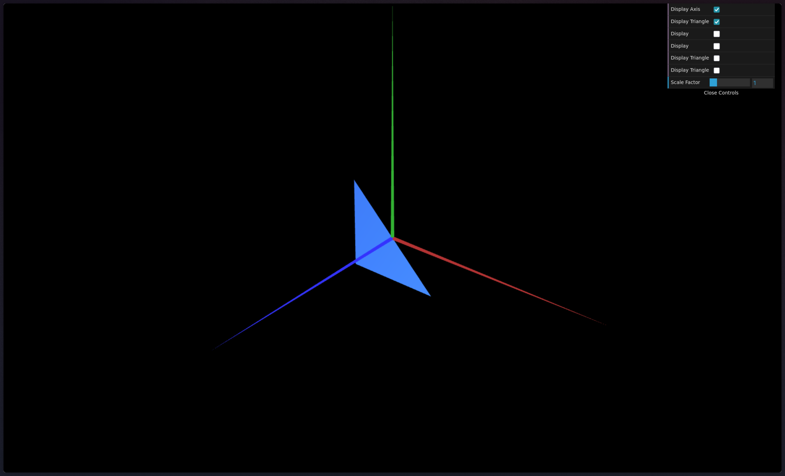
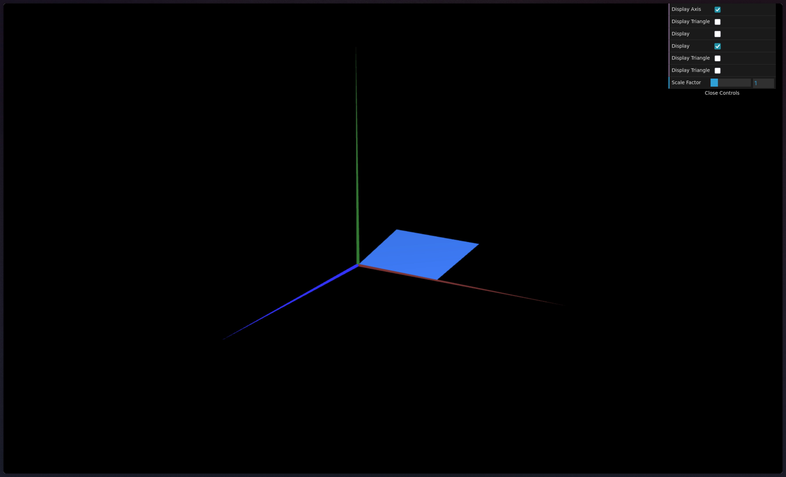
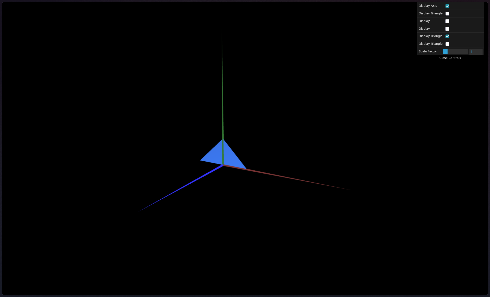
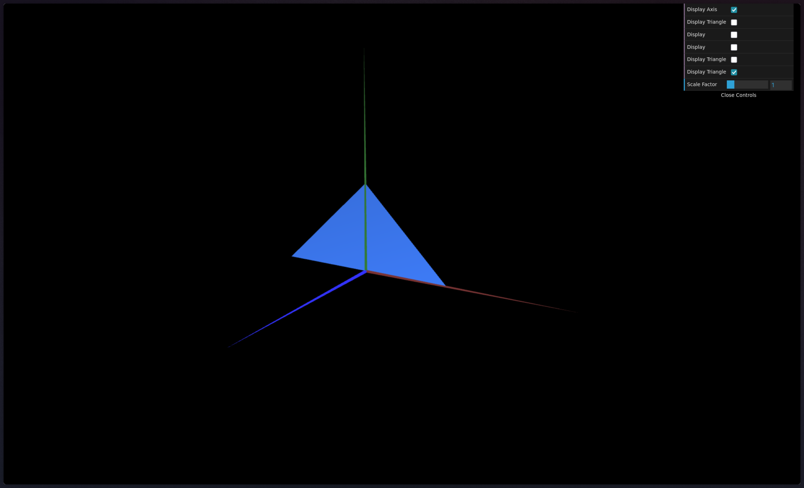

# CG 2025/2026

## Group T10G06

## TP 1 Notes

In exercise 1, we followed the example of `MyDiamond` to create both a Triangle and a Parallelogram, in which we added visibility control via Checkboxes in a GUI.

In exercise 2, we replicated the Triangle in a Small and Bigger sizes.

