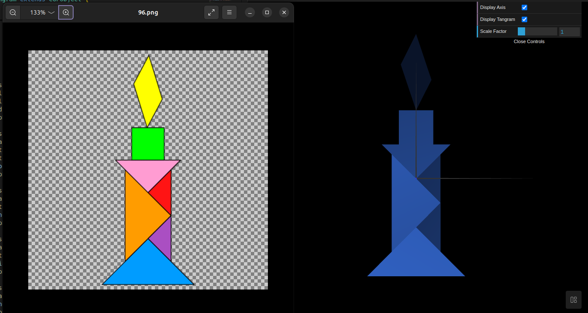
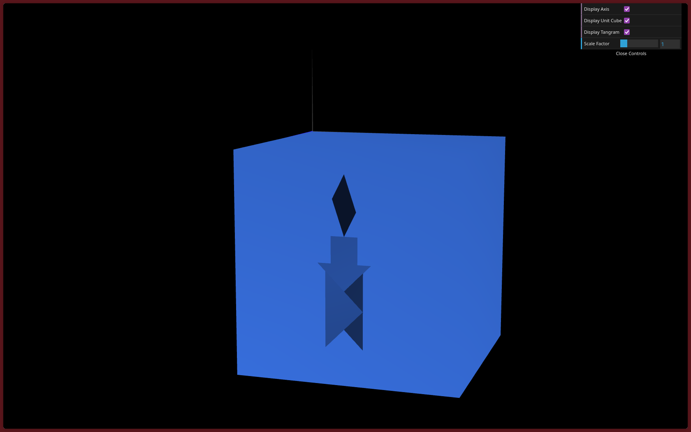
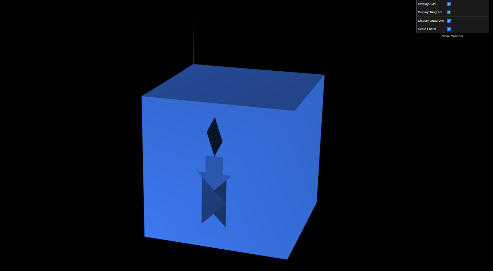

# CG 2025/2026

## Group T10G06

## TP 1 Notes

In exercise 1, we recreated a Tangram figure by instantiating MyDiamond using 4x4 transformation matrices and multMatrix(). The remaining pieces were positioned using CGFscene transformation methods (translate, rotate, scale) and managed with pushMatrix() and popMatrix() to maintain the origin as a reference.
Then we created a MyTangram class to encapsulate all individual pieces and moved the transformation logic into MyTangram.display() to treat the entire figure as a single, modular object within the scene.

For exercise 2, we developed a MyUnitCube class by defining 8 vertices and their connectivity in initBuffers() to create a solid mesh. This cube was then transformed to serve as a base/frame for the Tangram, with the entire assembly reoriented parallel to the XZ plane.

Finally for exercise 3, we created a MyQuad class to represent a unit square and used it to build MyUnitCubeQuad. This version of the cube was constructed by invoking and transforming the MyQuad object six times to form the cube's faces.

