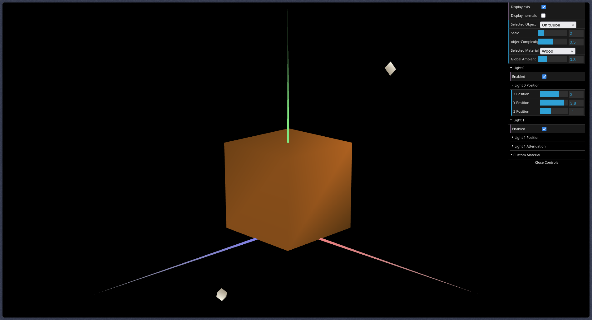
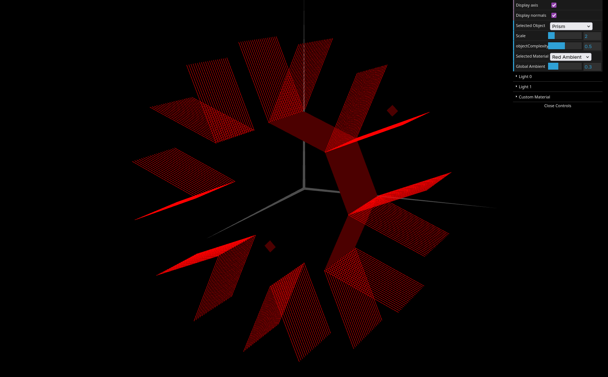
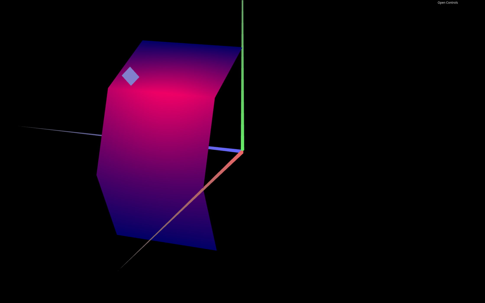

# CG 2025/2026

## Group T10G06

## TP 2 Notes

### Exercises 1 - 3: Integration and Normals

We began by importing the `MyTangram` and `MyUnitCube` classes from the previous assignment into the current scene. Initially, these objects appeared with inconsistent lighting because their normal vectors had not yet been defined. To resolve this, we implemented the `initBuffers()` method for each class to declare normals. For the cube, we learned that vertices must be duplicated; since a single corner is shared by three faces with different orientations, it requires three distinct normals to reflect light correctly.

### Exercises 4 - 6: Materials and Specular Reflection

In these exercises, we explored the `CGFappearance` class to manipulate lighting components. We created a wood-like material for the cube characterized by a low specular component to simulate a matte finish. Conversely, for the Tangram, we developed unique materials for each piece using high specular components and specific RGB colors to create sharp, bright highlights. Finally, we linked the `MyDiamond` piece to a "Custom" material, allowing real-time adjustments of its properties through the graphical interface

<table style="width:100%; table-layout:fixed;">
	<tr>
		<td style="width:50%;"></td>
		<td style="width:50%;"></td>
	</tr>
	<tr>
		<td align="center">Cube with wood-like material</td>
		<td align="center">Tangram with Custom material</td>
	</tr>
</table>

### Exercises 7 - 9: The MyPrism Class

We developed the `MyPrism` class to generate a geometric shape inscribed in a cylinder with a radius of one unit and a height of one in the Z-axis. The implementation supports a variable number of "sides" (slices) and "floors" (stacks). To maintain sharp edges (faceted shading), we calculated normals that are strictly perpendicular to each face. This required defining each vertex multiple times so that each face could maintain its own lighting vector. This method effectively simulates "Constant Shading".

#### Commentary on "Constant Shading"

Tthe normal vectors for all vertices belonging to a single face are defined as strictly perpendicular to that specific face. This requires duplicating vertices at the edges where two faces meet, ensuring that each face has its own set of independent normals.

Because every vertex on a face shares the exact same normal vector, the lighting equations calculated by the GPU—which typically interpolate values across a surface—receive the same input for every fragment of that face. Consequently, the entire polygon is rendered with a uniform color and intensity.

This visual result is effectively identical to Constant Shading. While modern WebGL pipelines often use per-fragment lighting, providing identical normals across a flat surface manually recreates the faceted, sharp-edged aesthetic where each "slice" of the prism is clearly distinguished from its neighbor.

### Exercises 10 - 13: The MyCylinder Class and Gouraud Shading

Finally, we created the `MyCylinder` class by adapting the prism logic. The key difference lies in the normals: instead of being perpendicular to the flat faces, the normals in `MyCylinder` are perpendicular to the surface of the imaginary cylinder it approximates. By sharing the same normal for a vertex used by two adjacent sides, the lighting transitions are smoothed out. This implementation of "Gouraud Shading" removes the visible edges, giving the object a curved, realistic appearance.

