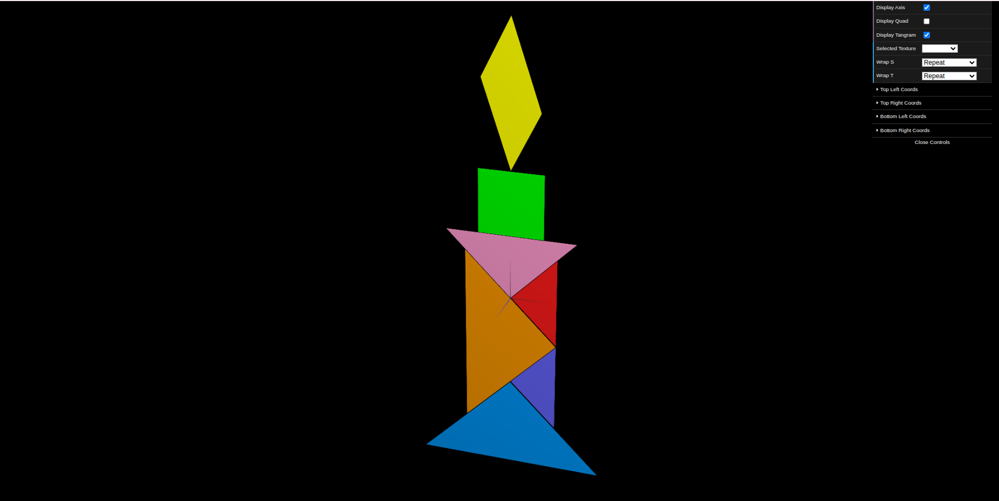
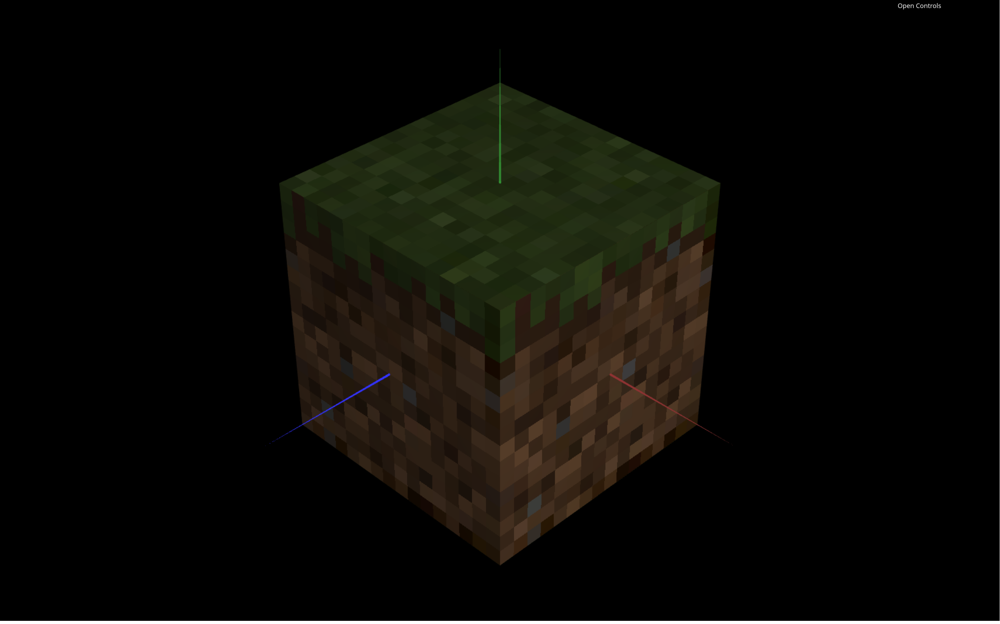

# CG 2025/2026

## Group T10G06

## TP 4 Notes

We began by importing the `MyTangram` and `MyQuad` classes from the previous assignment into the current scene. We integrated these objects into the scene hierarchy and created an interface checkbox that allows the user to hide the `MyQuad` object and its associated `quadMaterial`. This interactive control provides a foundation for managing object visibility in the graphical scene.

### Exercises 1 - 3: Applying Textures to Tangram

We created a new material at startup to be applied to the Tangram's `MyDiamond` object with the texture image `tangram.png`. To properly map this texture onto the geometry, we set the texture coordinates for the `MyDiamond` class by determining which vertices correspond to which positions in the texture space (S and T coordinates between 0.0 and 1.0). We then defined a `texCoords` array in the `initBuffers()` function with coordinate pairs for each vertex.

Following this pattern, we repeated the texture application process for each of the other Tangram pieces, ensuring that each piece was properly mapped to its corresponding region in the texture image. This required careful analysis of the texture layout to align piece boundaries with texture edges.

### Exercises 4 - 7: Applying Textures to a Cube composed of planes

We copied the `MyUnitCubeQuad` class from TP2, which defines a unit cube using a `MyQuad` object for each face. We modified the constructor to accept six texture parameters (CGFtexture) that are applied to the cube faces in order: top (+Y), front (+Z), right (+X), back (-Z), left (-X), and bottom (-Y). We then updated the `display()` function to apply the appropriate texture before rendering each face.

Subsequently, we created an instance of `MyUnitCubeQuad` with the textures `mineSide.png` (applied to the four side faces), `mineTop.png` (top face), and `mineBottom.png` (bottom face) to create a cohesive textured cube.

#### Texture Filtering and Linear Interpolation

We observed that the textures appeared poorly defined, displaying visible pixelation and artifacts. This occurred because the textures have original dimensions of only 16×16 pixels, but they are being applied to a much larger drawing area on the screen. By default, WebGL applies LINEAR FILTERING, which performs linear interpolation of colors across the enlarged texture surface. While this produces smooth gradients rather than sharp pixelation, it results in blurred, low-quality appearance.

We investigated the available filtering options in the code and found the mechanism to change the texture filtering mode. By applying NEAREST filtering (also called point sampling or nearest-neighbor interpolation) instead of LINEAR, we achieved the intended pixelated aesthetic where each original texture pixel is preserved as a discrete block. This filtering mode maintains the sharp, blocky appearance appropriate for the mine texture style.

